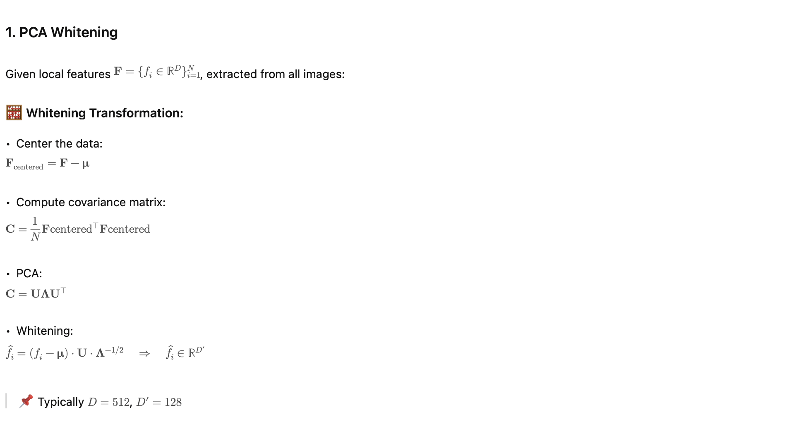

# ASMK Summary (Formulas)

---

## **✅ Key Properties**

| **Property** | **Description** |
| --- | --- |
| **Compact** | Each image descriptor ≪ 1KB (after binarization) |
| **Sparse** | Only a few bins activated per image (10–50) |
| **Fast** | Matching via Hamming distance or bitwise inner product |
| **Scalable** | Efficient for large-scale image retrieval tasks |
| **Descriptor-free matching** | Enables fast geometric verification downstream |

---

## **🔁 Inverted Index**

In ASMK, the **inverted index** is a core data structure that allows **sparse and efficient retrieval** by mapping **visual words (bins)** to the images that activated them.

Instead of comparing descriptors between all image pairs, the inverted index lets you:

> Only compare images that share at least one activated bin.
> 

---

## **🗂 Structure of the Inverted Index**

---

## **🔍 Retrieval Process Using the Inverted Index**

---

## **⚙️ Key Benefits of the Inverted Index**

| **Feature** | **Description** |
| --- | --- |
| **Sparse matching** | Only match on shared bins, skipping irrelevant image pairs |
| **Efficient storage** | Each image activates few bins (10–50 out of 10K) |
| **Scalable** | Suitable for millions of images |
| **Fast computation** | Especially when using binarized codes and SIMD-friendly Hamming metrics |

---

## **📦 Summary Descriptor Format**

\mathcal{V} = \{ (k, b_k) \ |\ k \text{ is a visual word, } b_k \in \{0,1\}^{D’} \}

Stored in the inverted index per bin k for quick lookup and comparison.

---

## **✅ Summary**

> The **inverted index** transforms ASMK into a **scalable retrieval system**, enabling fast, memory-efficient, and sparse matching by organizing descriptors **per visual word**.
> 

---
