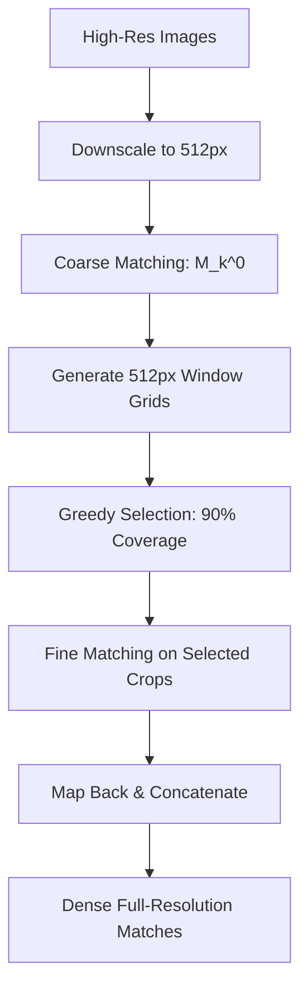

# MASt3R Coarse-to-Fine Matching: Technical Analysis Report

## Executive Summary

The MASt3R coarse-to-fine (C2F) matching system solves the fundamental limitation of Vision Transformers in handling high-resolution images for dense correspondence matching. By combining coarse global matching with fine-grained local processing, it preserves matching accuracy while operating within computational constraints.

## Core Problem & Motivation

**Fundamental Limitation**: Due to the quadratic complexity of attention with respect to input image area (W×H), MASt3R only handles images of **512 pixels in their largest dimension**. Larger images require significantly more compute power to train, and Vision Transformers do not generalize to larger test-time resolutions.

**Critical Challenge**: High-resolution images (e.g., 1M pixels) must be downscaled for matching, then correspondences are upscaled back to original resolution. This leads to:
- Performance degradation 
- Substantial reduction in localization accuracy
- Poor reconstruction quality

**Solution**: Coarse-to-fine matching preserves the benefits of high-resolution matching using a lower-resolution algorithm through intelligent crop selection and hierarchical processing.

## Key Technical Innovations

### 1. Adaptive Grid Generation
The system creates overlapping grids that respect model constraints while maximizing coverage:

```python
def _make_overlapping_grid(H, W, size, overlap):
    H_win = multiple_of_16(H * size // max(H, W))
    W_win = multiple_of_16(W * size // max(H, W))
    x = _start_pos(W, W_win, overlap)
    y = _start_pos(H, H_win, overlap)
    grid = np.stack(np.meshgrid(x, y, indexing='xy'), axis=-1)
    grid = np.concatenate((grid, grid + (W_win, H_win)), axis=-1)
    return grid.reshape(-1, 4)
```

**Innovation**: Ensures crop dimensions are multiples of 16 (model requirement) while maintaining aspect ratios.

### 2. Correspondence-Driven Scoring 

Each crop pair is scored based on the density and quality of point correspondences, and Update the cell2 center and size:

```python
def _weight_pixels(cell, pix, assigned, gauss_var=2):
    center = cell.reshape(-1, 2, 2).mean(axis=1)
    width, height = _cell_size(cell)

    # square distance between each cell center and each point
    dist = (center[:, None] - pix[None]) / np.c_[width, height][:, None]
    dist2 = np.square(dist).sum(axis=-1)

    assert assigned.shape == dist2.shape
    res = np.where(assigned, np.exp(-gauss_var * dist2), 0)
    return res
    
def _score_cell(cell1, H2, W2, p1, p2, min_corres=10, forced_resolution=None):
    assert p1.shape == p2.shape

    # compute keypoint assignment
    assigned = pos2d_in_rect(p1, cell1[None].T)
    assert assigned.shape == (len(cell1), len(p1))

    # remove cells without correspondences
    valid_cells = assigned.sum(axis=1) >= min_corres
    cell1 = cell1[valid_cells]
    assigned = assigned[valid_cells]
    if not valid_cells.any():
        return cell1, cell1, assigned

    # fill-in the assigned points in both image
    assigned_p1 = np.empty((len(cell1), len(p1), 2), dtype=np.float32)
    assigned_p2 = np.empty((len(cell1), len(p2), 2), dtype=np.float32)
    assigned_p1[:] = p1[None]
    assigned_p2[:] = p2[None]
    assigned_p1[~assigned] = np.nan
    assigned_p2[~assigned] = np.nan

    # find the median center and scale of assigned points in each cell
    # cell_center1 = np.nanmean(assigned_p1, axis=1)
    cell_center2 = np.nanmean(assigned_p2, axis=1)
    im1_q25, im1_q75 = np.nanquantile(assigned_p1, (0.1, 0.9), axis=1)
    im2_q25, im2_q75 = np.nanquantile(assigned_p2, (0.1, 0.9), axis=1)

    robust_std1 = (im1_q75 - im1_q25).clip(20.)
    robust_std2 = (im2_q75 - im2_q25).clip(20.)

    cell_size1 = (cell1[:, 2:4] - cell1[:, 0:2])
    cell_size2 = cell_size1 * robust_std2 / robust_std1
    cell2 = np.c_[cell_center2 - cell_size2 / 2, cell_center2 + cell_size2 / 2]

    # make sure cell bounds are valid
    cell2 = _norm_windows(cell2, H2, W2, forced_resolution=forced_resolution)

    # compute correspondence weights
    corres_weights = _weight_pixels(cell1, p1, assigned) * _weight_pixels(cell2, p2, assigned)

    # return a list of window pairs and assigned correspondences
    return cell1, cell2, corres_weights
```

**Key Features**:
- Minimum correspondence threshold filtering
- Robust statistics using quantiles (10th-90th percentile)
- Gaussian weighting based on distance to crop center

### 3. Greedy Coverage Optimization
The selection algorithm maximizes correspondence coverage while minimizing redundancy:

```python
def greedy_selection(corres_weights, target=0.9):
    # corres_weight = (n_cell_pair, n_corres) matrix.
    # If corres_weight[c,p]>0, means that correspondence p is visible in cell pair p
    assert 0 < target <= 1
    corres_weights = corres_weights.copy()

    total = corres_weights.max(axis=0).sum()
    target *= total

    # init = empty
    res = []
    cur = np.zeros(corres_weights.shape[1])  # current selection

    while cur.sum() < target:
        # pick the nex best cell pair
        best = corres_weights.sum(axis=1).argmax()
        res.append(best)

        # update current
        cur += corres_weights[best]
        # print('appending', best, 'with score', corres_weights[best].sum(), '-->', cur.sum())

        # remove from all other views
        corres_weights = (corres_weights - corres_weights[best]).clip(min=0)

    return res
```
### 4. Select pairs of Crops
```python

def select_pairs_of_crops(img_q, img_b, pos2d_in_query, pos2d_in_ref, maxdim=512, overlap=.5, forced_resolution=None):
    # prepare the overlapping cells
    grid_q = _make_overlapping_grid(*img_q.shape[:2], maxdim, overlap)
    grid_b = _make_overlapping_grid(*img_b.shape[:2], maxdim, overlap)

    assert forced_resolution is None or len(forced_resolution) == 2
    if isinstance(forced_resolution[0], int) or not len(forced_resolution[0]) == 2:
        forced_resolution1 = forced_resolution2 = forced_resolution
    else:
        assert len(forced_resolution[1]) == 2
        forced_resolution1 = forced_resolution[0]
        forced_resolution2 = forced_resolution[1]

    # Make sure crops respect constraints
    grid_q = _norm_windows(grid_q.astype(float), *img_q.shape[:2], forced_resolution=forced_resolution1)
    grid_b = _norm_windows(grid_b.astype(float), *img_b.shape[:2], forced_resolution=forced_resolution2)

    # score cells
    pairs_q = _score_cell(grid_q, *img_b.shape[:2], pos2d_in_query, pos2d_in_ref, forced_resolution=forced_resolution2)
    pairs_b = _score_cell(grid_b, *img_q.shape[:2], pos2d_in_ref, pos2d_in_query, forced_resolution=forced_resolution1)
    pairs_b = pairs_b[1], pairs_b[0], pairs_b[2]  # cellq, cellb, corres_weights

    # greedy selection until all correspondences are generated
    cell1, cell2, corres_weights = map(np.concatenate, zip(pairs_q, pairs_b))
    if len(corres_weights) == 0:
        return  # tolerated for empty generators
    order = greedy_selection(corres_weights, target=0.9)

    for i in order:
        def pair_tag(qi, bi): return (str(qi) + crop_tag(cell1[i]), str(bi) + crop_tag(cell2[i]))
        yield cell1[i], cell2[i], pair_tag
```

**Algorithm**: Iteratively selects crop pairs that contribute the most uncovered correspondences until 90% target coverage is achieved.

## Algorithm Overview

### Three-Phase Pipeline


### Official Algorithm Steps

**Step 1**: Perform matching on downscaled versions (512px max dimension)
- Obtain coarse correspondences M_k^0 with subsampling factor k

**Step 2**: Generate overlapping window grids W¹, W² ∈ ℝ^(w×4)
- Each window: 512 pixels in largest dimension  
- Contiguous windows: 50% overlap
- Enumerate all window pairs (w₁, w₂) ∈ W¹ × W²

**Step 3**: Greedy window selection
- Select subset covering most coarse correspondences M_k^0
- Add window pairs until 90% correspondence coverage

**Step 4**: Independent fine matching per window pair
- D^w1, D^w2 = MASt3R(I_w1, I_w2)
- M_k^w1,w2 = fast_reciprocal_NN(D^w1, D^w2)

**Step 5**: Merge results
- Map correspondences back to original coordinates
- Concatenate all window results

## Conclusion

MASt3R's coarse-to-fine matching elegantly solves the Vision Transformer resolution limitation through intelligent hierarchical processing. By using coarse correspondences to guide fine-scale computation, it achieves dense high-resolution matching while respecting the 512px constraint of the base model.

**Core Innovation**: Transform the resolution limitation from a constraint into an optimization opportunity - process only where correspondences indicate meaningful content.

**Key Results**:
- Enables high-resolution matching with 512px-limited models
- 4-8x memory reduction with preserved accuracy  
- 90% correspondence coverage with minimal redundancy
- Seamless integration with existing ViT-based architectures

**Applications**: Visual localization, SLAM, structure-from-motion, and any dense correspondence task requiring high-resolution precision with computational constraints.
