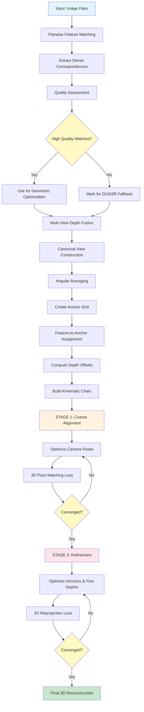
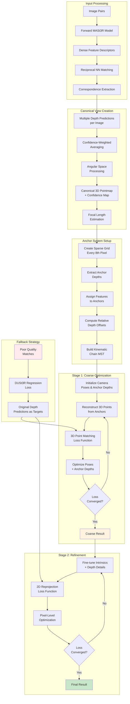

# MASt3R Sparse Global Alignment: A Complete Tutorial

## Overview

MASt3R (Matching And Stereo 3D Reconstruction) introduces a novel sparse global alignment approach that efficiently optimizes multi-view 3D reconstruction. Unlike traditional dense methods that optimize millions of depth parameters, MASt3R uses an **anchor-based representation** that provides the same reconstruction quality with dramatically improved efficiency.

## Process Flowchart



## Key Innovation: Anchor-Based Depth Representation

The core insight is to represent scene geometry using:
- **Sparse anchor points**: A coarse grid of optimizable 3D points
- **Dense feature correspondences**: All matched pixels for rich constraints
- **Relative depth offsets**: Fixed relationships between features and anchors

This gives you **dense constraints with sparse parameterization**.

---

## Detailed Component Flowchart



## Step 1: Feature Matching and Correspondence Extraction

### 1.1 Pairwise Feature Matching
```python
# For each image pair, extract dense correspondences
pairs, cache_path = forward_mast3r(pairs_in, model, cache_path=cache_path, 
                                   subsample=subsample, desc_conf=desc_conf)

# This produces:
# - Dense feature descriptors for each image
# - Reciprocal nearest neighbor matches
# - Confidence scores for each correspondence
```

### 1.2 Correspondence Quality Assessment
```python
def matching_check(x): 
    return x.max() > matching_conf_thr  # Default: 5.0

is_matching_ok = {}
for img1, img2 in pairs:
    is_matching_ok[img1, img2] = matching_check(correspondence_confidences)
```

**Key Point**: Only high-quality matches will be used for geometric optimization. Poor matches fall back to DUSt3R's regression loss.

---

## Step 2: Canonical View Construction

### 2.1 Multi-View Depth Fusion
For each target image, collect depth predictions from **all pairs** where it appears:

```python
def canonical_view(ptmaps11, confs11, subsample, mode='avg-angle'):
    # ptmaps11: [N_pairs, H, W, 3] - multiple 3D predictions
    # confs11: [N_pairs, H, W] - confidence scores
    
    # Weighted average in 3D space
    confs11 = confs11.unsqueeze(-1) - 0.999
    canon = (confs11 * ptmaps11).sum(0) / confs11.sum(0)
```

### 2.2 Angular Averaging (Key Innovation)
Instead of averaging depths directly, MASt3R averages **viewing angles**:

```python
# Convert depth differences to viewing angles
stacked_radius = (stacked_xy - center_xy).norm(dim=1)
stacked_angle = torch.arctan((stacked_depth - center_depth) / stacked_radius)

# Average angles (more stable than averaging depths)
avg_angle = (stacked_confs * stacked_angle).sum(dim=0) / stacked_confs.sum(dim=0)

# Convert back to depth
stacked_depth = stacked_radius.mean(dim=0) * torch.tan(avg_angle)
```

**Why Angular Averaging?**
- More geometrically consistent across viewpoints
- Less sensitive to absolute depth scale
- Better handling of outliers

### 2.3 Output
Each image now has:
- **Canonical 3D pointmap**: High-quality reference geometry
- **Confidence map**: Reliability estimation
- **Focal length estimate**: From depth-aware focal estimation

---

## Step 3: Anchor Grid Creation

### 3.1 Sparse Anchor Placement
```python
# Create regular grid of anchor points
subsample = 8  # Every 8th pixel
yx = np.mgrid[subsample//2:H:subsample, subsample//2:W:subsample]
cy, cx = yx.reshape(2, -1)
core_depth = canonical_depth[cy, cx]  # Depths at anchor locations
```

### 3.2 Feature-to-Anchor Assignment
```python
def anchor_depth_offsets(canon_depth, feature_pixels, subsample=8):
    px, py = feature_pixels.long().T
    
    # Assign each feature to nearest anchor (block quantization)
    core_idx = (py // subsample) * W2 + (px // subsample)
    
    # Compute relative depth offset
    anchor_depth = core_depth[core_idx]
    feature_depth = canon_depth[py, px]
    offset = feature_depth / anchor_depth  # Multiplicative offset
    
    return core_idx, offset
```

**Result**: Each feature point is now represented as:
- `anchor_id`: Which anchor it references
- `depth_offset`: Multiplicative factor relative to anchor depth

---

## Step 4: Kinematic Chain Construction

### 4.1 Spanning Tree Creation
Instead of optimizing all camera poses independently, MASt3R builds a **kinematic chain**:

```python
if kinematic_mode == 'hclust-ward':
    # Hierarchical clustering to find optimal tree structure
    distance_matrix = 1 - pairwise_matching_scores
    Z = scipy.cluster.hierarchy.linkage(distance_matrix, method='ward')
    
    # Extract minimal spanning tree
    mst = compute_min_spanning_tree(connection_weights)
```

**Benefits**:
- Prevents scale drift
- More stable optimization
- Root camera provides global reference frame

---

## Step 5: Two-Stage Optimization

### Stage 1: Coarse Alignment (3D Point Matching)

#### 5.1 Parameterization
```python
# Camera poses (relative to kinematic chain)
quats = [nn.Parameter(unit_quaternion) for _ in range(len(imgs))]  # Rotations
trans = [nn.Parameter(torch.zeros(3)) for _ in range(len(imgs))]   # Translations
log_sizes = [nn.Parameter(torch.zeros(1)) for _ in range(len(imgs))]  # Scales

# Depth representation (anchor-based)
core_depth = [nn.Parameter(anchor_depths.ravel()) for _ in range(len(imgs))]

# Intrinsics
log_focals = [nn.Parameter(focal.log()) for focal in base_focals]
pps = [nn.Parameter(principal_point) for pp in principal_points]
```

#### 5.2 3D Point Reconstruction
```python
def make_pts3d(anchors, K, cam2w, anchor_depths):
    for img, (feature_pixels, anchor_ids, depth_offsets) in anchors.items():
        # Compute depth for each feature point
        feature_depths = anchor_depths[img][anchor_ids] * depth_offsets
        
        # Back-project to 3D
        pts3d = proj3d(inv(K[img]), feature_pixels, feature_depths)
        
        # Transform to world coordinates
        pts3d = geotrf(cam2w[img], pts3d)
```

#### 5.3 Loss Function: 3D Point Matching
```python
def loss_3d(K, w2cam, pts3d, pix_loss):
    total_loss = 0
    for correspondence in all_correspondences:
        # Get 3D points from both images
        pts_img1 = pts3d[correspondence.img1][correspondence.slice1]
        pts_img2 = pts3d[correspondence.img2][correspondence.slice2]
        
        # Weighted distance loss
        total_loss += correspondence.confidences @ pix_loss(pts_img1, pts_img2)
    
    return total_loss / total_confidences
```

**What's optimized**: Camera poses + anchor depths
**What's frozen**: Intrinsics, depth offsets
**Goal**: Get camera poses roughly correct

### Stage 2: Refinement (2D Reprojection)

#### 5.4 Loss Function: Reprojection Error
```python
def loss_2d(K, w2cam, pts3d, pix_loss):
    proj_matrix = K @ w2cam[:, :3]  # Camera projection matrices
    total_loss = 0
    
    for img1, feature_pixels, confidences, other_imgs in correspondences_2d:
        # Get 3D points from other images
        pts3d_from_others = [pts3d[img2][slice2] for img2, slice2 in other_imgs]
        
        # Reproject into current image
        reprojected_pixels = reproj2d(proj_matrix[img1], pts3d_from_others)
        
        # Pixel-level reprojection error
        total_loss += confidences @ pix_loss(feature_pixels, reprojected_pixels)
    
    return total_loss
```

**What's optimized**: Intrinsics + fine depth adjustments
**Goal**: Pixel-accurate geometric consistency

---

## Step 6: Fallback Strategy

For image pairs with poor feature matching:

```python
def loss_dust3r(cam2w, pts3d, pix_loss):
    # Use original DUSt3R predictions as regression targets
    for poor_quality_pair in dust3r_fallback_pairs:
        target_pts, target_confs = original_dust3r_predictions[pair]
        target_pts = transform_to_world(target_pts, cam2w)
        
        loss += target_confs @ pix_loss(pts3d[pair.img1], target_pts)
```

**Total Loss**:
```python
total_loss = main_loss + fallback_weight * dust3r_loss
```

---

## Key Advantages

### 1. **Efficiency**
- **Dense methods**: Optimize ~500K depth parameters per image
- **MASt3R**: Optimize ~4K anchor depths per image (125x reduction)
- **Same quality**: All feature correspondences still provide constraints

### 2. **Stability**
- **Kinematic chain**: Prevents scale drift and pose degeneracies  
- **Angular averaging**: More robust depth fusion
- **Confidence weighting**: Focus optimization on reliable correspondences

### 3. **Robustness**
- **Multi-stage**: Coarse-to-fine optimization strategy
- **Fallback mechanism**: Handle poor matching gracefully
- **Quality-aware**: Adapt strategy based on matching confidence

---

## Implementation Tips

### Memory Management
```python
# Use appropriate data types
dtype = torch.float32  # Good balance of precision/memory

# Cache intermediate results
canonical_cache = f'{cache_path}/canon_views/{hash_md5(img)}.pth'
if os.path.exists(canonical_cache):
    canonical_view = torch.load(canonical_cache)
```

### Hyperparameter Guidelines
```python
# Optimization settings
lr1 = 0.07          # Learning rate for coarse stage
niter1 = 300        # Iterations for coarse stage  
lr2 = 0.01          # Learning rate for refinement
niter2 = 300        # Iterations for refinement

# Anchor settings
subsample = 8       # Anchor grid spacing (8x8 pixel blocks)
matching_conf_thr = 5.0  # Minimum confidence for using matches

# Loss functions
loss1 = gamma_loss(1.5)  # Robust loss for coarse stage
loss2 = gamma_loss(0.5)  # Tighter loss for refinement
```

### Quality Monitoring
```python
# Track optimization progress
with tqdm(total=niter) as bar:
    for iter in range(niter):
        # ... optimization step ...
        bar.set_postfix_str(f'{lr=:.4f}, {loss=:.3f}')
        
        # Early stopping on NaN
        if loss != loss:
            break
```

---

## Conclusion

MASt3R's sparse global alignment represents a significant advancement in multi-view 3D reconstruction by:

1. **Decoupling representation from constraints**: Dense correspondences with sparse parameterization
2. **Robust multi-view fusion**: Angular averaging and confidence weighting
3. **Stable optimization**: Kinematic chains and coarse-to-fine strategy
4. **Practical efficiency**: 125x reduction in parameters without quality loss

This approach makes high-quality 3D reconstruction accessible for larger scenes and real-time applications while maintaining the geometric accuracy of traditional dense methods.
