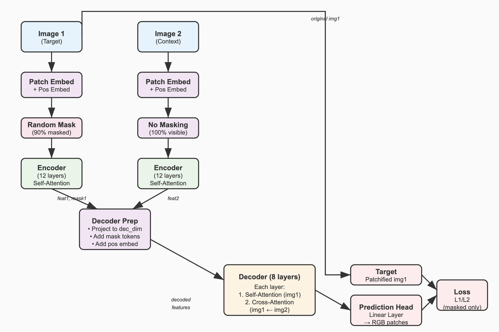

# CroCo (Cross-view Completion) Model Tutorial

[CroCo: Self-Supervised Pre-training for 3D Vision Tasks by Cross-View Completion](https://arxiv.org/abs/2210.10716)

[CroCo Code](https://github.com/naver/croco/tree/d7de0705845239092414480bd829228723bf20de)

## Overview

CroCo is a self-supervised vision transformer model that learns to complete masked regions in one image by using information from a second, related image. This approach is particularly useful for tasks involving stereo vision, temporal sequences, or multi-view scenarios.(only one encoder)



## Key Concepts

### 1. **Masked Autoencoding with Cross-view Context**
- Traditional masked autoencoders (MAE) reconstruct masked patches using only the visible patches from the same image
- CroCo introduces a second image as additional context for reconstruction
- This enables learning of correspondences and relationships between different viewpoints

### 2. **Dual-Image Architecture**
- **Image 1 (Target)**: Heavily masked (90% by default), needs reconstruction
- **Image 2 (Context)**: Fully visible, provides contextual information

## Architecture Components

### Core Building Blocks

#### 1. **PatchEmbed** (from `blocks.py`)
```python
class PatchEmbed(nn.Module):
    def __init__(self, img_size=224, patch_size=16, in_chans=3, embed_dim=768):
        # Converts images into patch embeddings
```
- Divides input images into non-overlapping patches
- Projects patches into embedding space
- Returns both embeddings and spatial positions
- Based on [RoPE2D](https://github.com/linyuanthocr/AI-Learning-Journal/blob/main/3D%20reconstruction%2Frope2d_theory_tutorial.md)

#### 2. **Block** (Encoder Transformer Block)
```python
class Block(nn.Module):
    def __init__(self, dim, num_heads, mlp_ratio=4.):
        self.attn = Attention(dim, num_heads=num_heads)
        self.mlp = Mlp(in_features=dim)
```
- Standard transformer block with self-attention
- Used in the encoder for processing both images

#### 3. **DecoderBlock** (Cross-Attention Transformer Block)
```python
class DecoderBlock(nn.Module):
    def __init__(self, dim, num_heads):
        self.attn = Attention(dim)           # Self-attention
        self.cross_attn = CrossAttention(dim) # Cross-attention
        self.mlp = Mlp(in_features=dim)
```
- Combines self-attention and cross-attention
- Self-attention: within the masked image features
- Cross-attention: between masked image and context image

## Model Architecture Flow

### Initialization Parameters

```python
CroCoNet(
    img_size=224,           # Input image size
    patch_size=16,          # Size of each patch
    mask_ratio=0.9,         # 90% of patches masked
    enc_embed_dim=768,      # Encoder feature dimension
    enc_depth=12,           # Number of encoder layers
    dec_embed_dim=512,      # Decoder feature dimension
    dec_depth=8,            # Number of decoder layers
    pos_embed='cosine',     # Positional embedding type
)
```

### Forward Pass Breakdown

#### Step 1: Patch Embedding
```python
# Convert images to patches
x1, pos1 = self.patch_embed(img1)  # Shape: [B, N, C]
x2, pos2 = self.patch_embed(img2)  # Shape: [B, N, C]
```

#### Step 2: Encoding Phase
```python
# Encode masked first image
feat1, pos1, mask1 = self._encode_image(img1, do_mask=True)
# Encode full second image  
feat2, pos2, _ = self._encode_image(img2, do_mask=False)
```

**Encoding Process:**
1. Apply positional embeddings
2. Generate random mask for img1 (keep only 10% of patches)
3. Pass visible patches through transformer encoder blocks
4. Output encoded features for visible patches only

#### Step 3: Decoding Phase
```python
decfeat = self._decoder(feat1, pos1, mask1, feat2, pos2)
```

**Decoding Process:**
1. Project encoder features to decoder dimension
2. Add mask tokens for invisible patches in img1
3. Apply positional embeddings
4. Process through decoder blocks with cross-attention
5. Each decoder block performs:
   - Self-attention within img1 features
   - Cross-attention between img1 (Q) and img2 features (K,V)
   - Feed-forward processing

#### Step 4: Prediction
```python
out = self.prediction_head(decfeat)  # Reconstruct RGB values
target = self.patchify(img1)         # Ground truth patches
```

## Detailed Component Analysis

### 1. Masking Strategy
```python
class RandomMask:
    def __init__(self, num_patches, mask_ratio=0.9):
        # Randomly selects patches to mask
```
- High masking ratio (90%) forces model to rely on context image
- Random masking prevents overfitting to specific patterns

### 2. Positional Embeddings
Two options available:
- **Cosine**: Standard 2D sinusoidal embeddings
- **RoPE2D**: 2D Rotary Position Embedding for better spatial understanding

### 3. Cross-Attention Mechanism
```python
def forward(self, query, key, value, qpos, kpos):
    # query: features from masked image
    # key, value: features from context image
    # Enables information flow from context to target
```

## Training Process

### Loss Function
```python
# Reconstruction loss (typically L1 or L2)
loss = F.l1_loss(predicted_patches, target_patches, reduction='mean')
```
- Only computed on masked patches
- Encourages model to use context image for reconstruction

### Data Requirements
- Pairs of related images (stereo pairs, temporal sequences, etc.)
- Images should share some visual content or viewpoint
- No explicit labels required (self-supervised)

## Key Advantages

1. **Cross-view Learning**: Learns correspondences between different viewpoints
2. **Self-supervised**: No manual annotations required
3. **Flexible**: Can handle various types of image pairs
4. **Scalable**: Transformer architecture scales with data and compute

## Use Cases

1. **Stereo Vision**: Reconstruct one camera view using another
2. **Temporal Modeling**: Predict future frames from past frames
3. **Multi-view Reconstruction**: Complete partial 3D observations
4. **Domain Transfer**: Adapt between different imaging conditions

## Implementation Tips

### 1. Data Preparation
```python
# Ensure image pairs are properly aligned
img1, img2 = load_image_pair()
# Apply same transformations to both images
transform = transforms.Compose([...])
img1, img2 = transform(img1), transform(img2)
```

### 2. Memory Optimization
- Use gradient checkpointing for deeper models
- Consider mixed precision training
- Adjust batch size based on available GPU memory

### 3. Hyperparameter Tuning
- **Mask ratio**: Higher ratios increase difficulty but improve generalization
- **Encoder/decoder depth**: Balance between capacity and efficiency  
- **Learning rate**: Start with 1e-4 and adjust based on convergence

## Comparison with Standard MAE

| Aspect | Standard MAE | CroCo |
|--------|-------------|-------|
| Input | Single image | Two related images |
| Context | Visible patches only | Visible patches + full second image |
| Learning | Intra-image patterns | Inter-image correspondences |
| Applications | General vision | Multi-view, temporal, stereo |

## Conclusion

CroCo extends the masked autoencoding paradigm to multi-image scenarios, enabling rich cross-view representations. The architecture's combination of masking, self-attention, and cross-attention creates a powerful framework for learning visual correspondences in a self-supervised manner.

The model's ability to leverage contextual information from related images makes it particularly suitable for applications where multiple viewpoints or temporal sequences are available, opening up new possibilities for self-supervised learning in computer vision.
