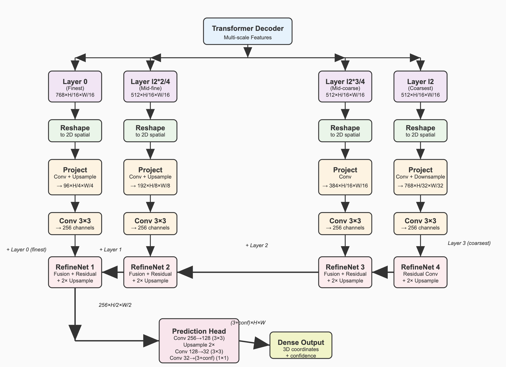

# DPT Code Implementation Walkthrough

## Core Architecture Flow


### 1. **Multi-Scale Feature Extraction**

```python
def forward(self, encoder_tokens: List[torch.Tensor], image_size=None):
    # Calculate spatial dimensions
    H, W = image_size
    N_H = H // (self.stride_level * self.P_H)  # Number of patches in height
    N_W = W // (self.stride_level * self.P_W)  # Number of patches in width
    
    # Hook into multiple decoder layers
    layers = [encoder_tokens[hook] for hook in self.hooks]
    # hooks = [0, l2*2//4, l2*3//4, l2]  # e.g., [0, 4, 6, 8]
```
**Purpose**: Extract features at 4 different abstraction levels from the transformer decoder
- **Layer 0**: Finest details, earliest processing
- **Layer l2*2//4**: Early-mid level features  
- **Layer l2*3//4**: Late-mid level features
- **Layer l2**: Highest abstraction, final decoder output

### 2. **Spatial Conversion**

```python
# Extract task-relevant tokens (remove global tokens if any)
layers = [self.adapt_tokens(l) for l in layers]

# Reshape from sequence to 2D spatial representation
layers = [rearrange(l, 'b (nh nw) c -> b c nh nw', nh=N_H, nw=N_W) for l in layers]
```
**Innovation**: Converts transformer's sequence representation back to spatial 2D format for CNN-style processing

### 3. **Feature Projection & Alignment**

```python
# Project to intermediate dimensions with appropriate scaling
layers = [self.act_postprocess[idx](l) for idx, l in enumerate(layers)]

# Standardize to common feature dimension (256)
layers = [self.scratch.layer_rn[idx](l) for idx, l in enumerate(layers)]
```

**Projection Strategy** (different for each scale):
```python
# Layer 0 (finest): Upsample 4x
self.act_1_postprocess = nn.Sequential(
    nn.Conv2d(dim_tokens_enc[0], layer_dims[0], kernel_size=1),
    nn.ConvTranspose2d(layer_dims[0], layer_dims[0], kernel_size=4, stride=4)
)

# Layer 1: Upsample 2x  
self.act_2_postprocess = nn.Sequential(
    nn.Conv2d(dim_tokens_enc[1], layer_dims[1], kernel_size=1),
    nn.ConvTranspose2d(layer_dims[1], layer_dims[1], kernel_size=2, stride=2)
)

# Layer 2: No scaling
self.act_3_postprocess = nn.Sequential(
    nn.Conv2d(dim_tokens_enc[2], layer_dims[2], kernel_size=1)
)

# Layer 3 (coarsest): Downsample 2x
self.act_4_postprocess = nn.Sequential(
    nn.Conv2d(dim_tokens_enc[3], layer_dims[3], kernel_size=1),
    nn.Conv2d(layer_dims[3], layer_dims[3], kernel_size=3, stride=2, padding=1)
)
```

### 4. **Progressive Feature Fusion**


FusionBlock
```python

class FeatureFusionBlock_custom(nn.Module):
    """Feature fusion block."""

    def __init__(
        self,
        features,
        activation,
        deconv=False,
        bn=False,
        expand=False,
        align_corners=True,
        width_ratio=1,
    ):
        """Init.
        Args:
            features (int): number of features
        """
        super(FeatureFusionBlock_custom, self).__init__()
        self.width_ratio = width_ratio

        self.deconv = deconv
        self.align_corners = align_corners

        self.groups = 1

        self.expand = expand
        out_features = features
        if self.expand == True:
            out_features = features // 2

        self.out_conv = nn.Conv2d(
            features,
            out_features,
            kernel_size=1,
            stride=1,
            padding=0,
            bias=True,
            groups=1,
        )

        self.resConfUnit1 = ResidualConvUnit_custom(features, activation, bn)
        self.resConfUnit2 = ResidualConvUnit_custom(features, activation, bn)

        self.skip_add = nn.quantized.FloatFunctional()

    def forward(self, *xs):
        """Forward pass.
        Returns:
            tensor: output
        """
        output = xs[0]

        if len(xs) == 2:
            res = self.resConfUnit1(xs[1])
            if self.width_ratio != 1:
                res = F.interpolate(res, size=(output.shape[2], output.shape[3]), mode='bilinear')

            output = self.skip_add.add(output, res)
            # output += res

        output = self.resConfUnit2(output)

        if self.width_ratio != 1:
            # and output.shape[3] < self.width_ratio * output.shape[2]
            #size=(image.shape[])
            if (output.shape[3] / output.shape[2]) < (2 / 3) * self.width_ratio:
                shape = 3 * output.shape[3]
            else:
                shape = int(self.width_ratio * 2 * output.shape[2])
            output  = F.interpolate(output, size=(2* output.shape[2], shape), mode='bilinear')
        else:
            output = nn.functional.interpolate(output, scale_factor=2,
                    mode="bilinear", align_corners=self.align_corners)
        output = self.out_conv(output)
        return output

def make_fusion_block(features, use_bn, width_ratio=1):
    return FeatureFusionBlock_custom(
        features,
        nn.ReLU(False),
        deconv=False,
        bn=use_bn,
        expand=False,
        align_corners=True,
        width_ratio=width_ratio,
    )
```

```python
# Bottom-up refinement (fushion block) with skip connections
path_4 = self.scratch.refinenet4(layers[3])  # Start with coarsest features
path_3 = self.scratch.refinenet3(path_4, layers[2])  # Fuse with layer 2
path_2 = self.scratch.refinenet2(path_3, layers[1])  # Fuse with layer 1  
path_1 = self.scratch.refinenet1(path_2, layers[0])  # Fuse with finest layer
```

**Feature Fusion Block Details**:

```python
class FeatureFusionBlock_custom(nn.Module):
    def forward(self, *xs):
        output = xs[0]  # Higher-level features (from previous fusion)
        
        if len(xs) == 2:
            res = self.resConfUnit1(xs[1])  # Lower-level features (skip connection)
            # Handle different spatial resolutions
            if self.width_ratio != 1:
                res = F.interpolate(res, size=(output.shape[2], output.shape[3]), mode='bilinear')
            output = self.skip_add.add(output, res)  # Skip connection
        
        output = self.resConfUnit2(output)  # Residual refinement
        
        # Upsample by 2x for next fusion stage
        output = F.interpolate(output, scale_factor=2, mode="bilinear")
        output = self.out_conv(output)  # Project to output channels
        return output
```

### 5. **Dense Prediction Head**


```python
# Regression head for 3D coordinates + confidence
self.head = nn.Sequential(
    nn.Conv2d(feature_dim, feature_dim // 2, kernel_size=3, stride=1, padding=1),
    Interpolate(scale_factor=2, mode="bilinear"),  # Final 2x upsample
    nn.Conv2d(feature_dim // 2, last_dim, kernel_size=3, stride=1, padding=1),
    nn.ReLU(True),
    nn.Conv2d(last_dim, self.num_channels, kernel_size=1)  # 3+conf channels
)
```

## 🔧 **DUSt3R-Specific Modifications**

### DPTOutputAdapter_fix vs Original DPT

```python
class DPTOutputAdapter_fix(DPTOutputAdapter):
    def init(self, dim_tokens_enc=768):
        super().init(dim_tokens_enc)
        # Remove duplicated preprocessing layers for efficiency
        del self.act_1_postprocess
        del self.act_2_postprocess  
        del self.act_3_postprocess
        del self.act_4_postprocess
        # Now uses self.act_postprocess ModuleList instead
```

**Key Changes**:
1. **Removed Duplication**: Original DPT had both individual `act_X_postprocess` and `act_postprocess` ModuleList
2. **Memory Efficiency**: DUSt3R uses only the ModuleList version
3. **Simplified Forward**: Cleaner implementation without redundant weights

### Spatial Cropping Fix
```python
# DUSt3R addition: Handle mismatched spatial dimensions
path_4 = self.scratch.refinenet4(layers[3])[:, :, :layers[2].shape[2], :layers[2].shape[3]]
```
**Purpose**: Ensures spatial compatibility between fusion stages

## 🎯 **Factory Function Design**

```python
def create_dpt_head(net, has_conf=False):
    """Create DPT head with network-specific parameters"""
    assert net.dec_depth > 9  # Ensure sufficient layers for multi-scale extraction
    
    l2 = net.dec_depth  # Total decoder depth
    feature_dim = 256   # Common DPT feature dimension
    last_dim = 128      # Intermediate dimension before final prediction
    out_nchan = 3       # xyz coordinates
    
    # Multi-scale hook selection
    hooks_idx = [0, l2*2//4, l2*3//4, l2]
    
    # Dimension alignment for each scale
    dim_tokens = [net.enc_embed_dim,    # Layer 0: encoder dimension
                  net.dec_embed_dim,    # Layer l2*2//4: decoder dimension  
                  net.dec_embed_dim,    # Layer l2*3//4: decoder dimension
                  net.dec_embed_dim]    # Layer l2: decoder dimension
    
    return PixelwiseTaskWithDPT(
        num_channels=out_nchan + has_conf,  # 3 + optional confidence
        feature_dim=feature_dim,
        last_dim=last_dim,
        hooks_idx=hooks_idx,
        dim_tokens=dim_tokens,
        postprocess=postprocess,
        depth_mode=net.depth_mode,
        conf_mode=net.conf_mode,
        head_type='regression'
    )
```

## 🧩 **Residual Convolution Units**

```python
class ResidualConvUnit_custom(nn.Module):
    def forward(self, x):
        out = self.activation(x)     # Pre-activation
        out = self.conv1(out)        # First 3x3 conv
        if self.bn: out = self.bn1(out)
        
        out = self.activation(out)   
        out = self.conv2(out)        # Second 3x3 conv  
        if self.bn: out = self.bn2(out)
        
        return self.skip_add.add(out, x)  # Residual connection
```
**Benefits**: 
- Improved gradient flow
- Feature refinement at each fusion stage
- Stability during training

## 📊 **Dimensional Analysis**

```python
# Example flow for 512×512 input image, patch_size=16
Input: transformer features [B, 1024, C]  # 32×32 patches

# Multi-scale extraction
Layer 0: [B, 1024, 768]  → reshape → [B, 768, 32, 32]
Layer 4: [B, 1024, 512]  → reshape → [B, 512, 32, 32]  
Layer 6: [B, 1024, 512]  → reshape → [B, 512, 32, 32]
Layer 8: [B, 1024, 512]  → reshape → [B, 512, 32, 32]

# After projection & standardization
Layer 0: [B, 256, 128, 128]  # Upsampled 4x
Layer 4: [B, 256, 64, 64]    # Upsampled 2x
Layer 6: [B, 256, 32, 32]    # Same scale
Layer 8: [B, 256, 16, 16]    # Downsampled 2x

# Progressive fusion (each stage upsamples 2x)
RefineNet4: [B, 256, 32, 32]    # 16→32
RefineNet3: [B, 256, 64, 64]    # 32→64  
RefineNet2: [B, 256, 128, 128]  # 64→128
RefineNet1: [B, 256, 256, 256]  # 128→256

# Final prediction  
Head output: [B, 256, 512, 512]  # Additional 2x upsample
Final: [B, 3+conf, 512, 512]     # Full resolution 3D + confidence
```

## 🚀 **Performance Optimizations**

1. **Efficient Skip Connections**: Direct feature fusion without expensive operations
2. **Progressive Upsampling**: Gradual resolution increase maintains spatial coherence  
3. **Shared Weights**: Common refinement blocks across fusion stages
4. **Quantized Operations**: `nn.quantized.FloatFunctional()` for mobile deployment
5. **Memory Management**: Deleted redundant preprocessing layers

The DPT architecture effectively bridges transformer representations and dense spatial predictions, making it ideal for DUSt3R's pixel-wise 3D reconstruction task.
