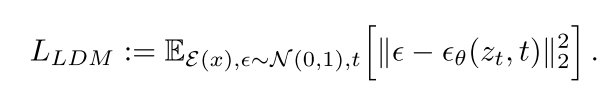
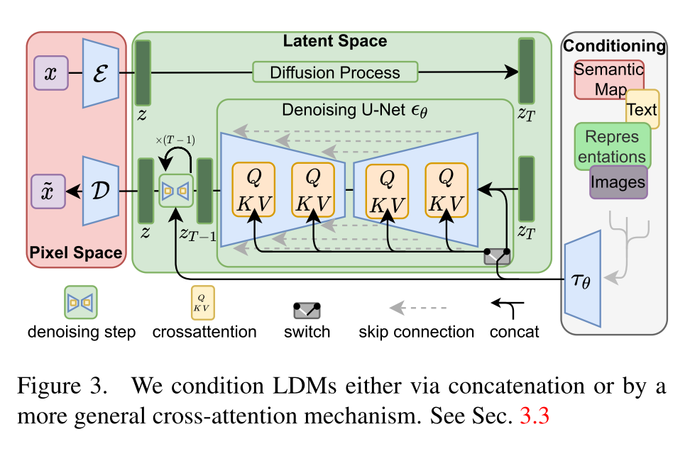
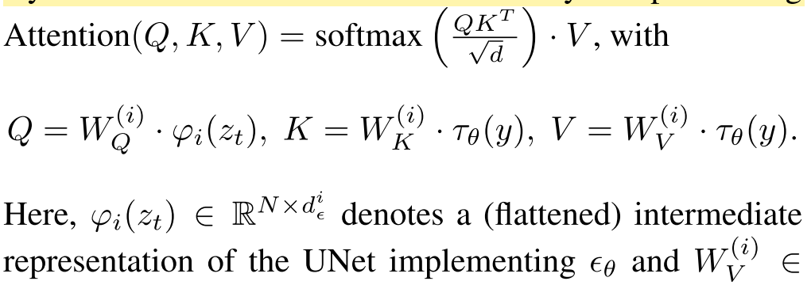
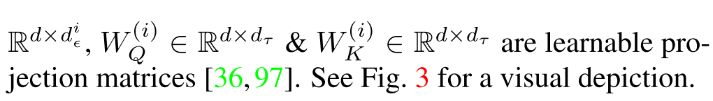
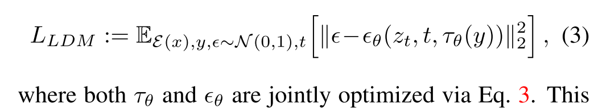
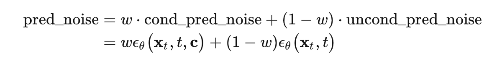

## High-Resolution Image Synthesis with Latent Diffusion Models

#### Background:
1. unaffordable computational cost for majority
2.  evaluation cost is quite expensive as well, need to run the model sequentially for a large numbers  of steps .
Key to enhance DM accessibility: reduce the computational complexity without impairing their performance. 

#### Contributions:
1. Ours can (a) work on a compression level which provides more faithful and detailed reconstructions than previous work (see Fig. 1) and (b) can be efficiently applied to high-resolution synthesis of megapixel images.
2.  (ii) We achieve competitive performance on multipletasks (unconditional image synthesis, inpainting, stochastic  ^super-resolution) and datasets while significantly lowering computational costs. Compared to pixel-based diffusion ap- proaches, we also significantly decrease inference costs. 
3. (iii) Our approach does not require a delicate weighting of reconstruction and generative abilities. This ensures extremely faithful reconstructions and requires very little regularization of the latent space. 
4. (iv) We find that for densely conditioned tasks such as super-resolution, inpainting and semantic synthesis, our model can be applied in a convolutional fashion and render large, consistent images of ∼ 1024^2 px.
5.  (v) Moreover, we design a general-purpose conditioning mechanism based on cross-attention, enabling multi-modal training. We use it to train class-conditional, text-to-image and layout-to-image models. 
6. (vi) Finally, we release pretrained latent diffusion and autoencoding models at https : / / github . com/CompVis/latent-diffusion which might be reusable for a various tasks besides training of DMs [81].


#### Method:
1.  Perceptional compression:
    *  Model: an auto-encoder trained by a perceptual loss + path-based adversarial objective. (Enforce Local realism & avoid bluriness)
    *  KL-reg &  VQ-reg(avoid to generate high-variance Latency spaces) & 2D representation for mild compression (rather than 1D)

2.  Latent diffusion model, neutral backbone is time-conditional UNet

<p align="center">
    
</p>


3.  Conditioning mechanisms
<p align="center">
    
</p>

introduce a domain specific encoder τθ that projects y to an intermediate representation τθ(y) ∈ RM×dτ, which is then mapped to the intermediate layers of the UNet via a cross-attention layer implementing






Usage:
Image generation, super-resolution, image inpainting

Sample Codes from HuggingFace:
```python
import torch
from diffusers import AutoencoderKL, UNet2DConditionModel, DDPMScheduler
from transformers import CLIPTextModel, CLIPTokenizer
import torch.nn.functional as F

# 加载autoencoder
vae = AutoencoderKL.from_pretrained("runwayml/stable-diffusion-v1-5", subfolder="vae")
# 加载text encoder
text_encoder = CLIPTextModel.from_pretrained("runwayml/stable-diffusion-v1-5", subfolder="text_encoder")
tokenizer = CLIPTokenizer.from_pretrained("runwayml/stable-diffusion-v1-5", subfolder="tokenizer")
# 初始化UNet
unet = UNet2DConditionModel(**model_config) # model_config为模型参数配置
# 定义scheduler
noise_scheduler = DDPMScheduler(
    beta_start=0.00085, beta_end=0.012, beta_schedule="scaled_linear", num_train_timesteps=1000
)

# 冻结vae和text_encoder
vae.requires_grad_(False)
text_encoder.requires_grad_(False)

opt = torch.optim.AdamW(unet.parameters(), lr=1e-4)

for step, batch in enumerate(train_dataloader):
    with torch.no_grad():
        # 将image转到latent空间
        latents = vae.encode(batch["image"]).latent_dist.sample()
        latents = latents * vae.config.scaling_factor # rescaling latents
        # 提取text embeddings
        text_input_ids = tokenizer(
            batch["text"],
            padding="max_length",
            max_length=tokenizer.model_max_length,
            truncation=True,
            return_tensors="pt"
  ).input_ids
  text_embeddings = text_encoder(text_input_ids)[0]
    
    # 随机采样噪音
    noise = torch.randn_like(latents)
    bsz = latents.shape[0]
    # 随机采样timestep
    timesteps = torch.randint(0, noise_scheduler.num_train_timesteps, (bsz,), device=latents.device)
    timesteps = timesteps.long()

    # 将noise添加到latent上，即扩散过程
    noisy_latents = noise_scheduler.add_noise(latents, noise, timesteps)

    # 预测noise并计算loss
    model_pred = unet(noisy_latents, timesteps, encoder_hidden_states=text_embeddings).sample
    loss = F.mse_loss(model_pred.float(), noise.float(), reduction="mean")

 opt.step()
    opt.zero_grad()
```
Where, beta is nonlinear.

```python
betas = torch.linspace(beta_start**0.5, beta_end**0.5, num_train_timesteps, dtype=torch.float32) ** 2
```

To train the diffusion model， CFG（conditional free guidance）is adopted.

<p align="center">
    
</p>

[HuggingFace— Stable diffusionv1.5](https://huggingface.co/runwayml/stable-diffusion-v1-5)

[文生图模型之Stable Diffusion](https://zhuanlan.zhihu.com/p/617134893)

[Diffusers: State-of-the-art diffusion models for image and audio generation in PyTorch](https://github.com/huggingface/diffusers)
