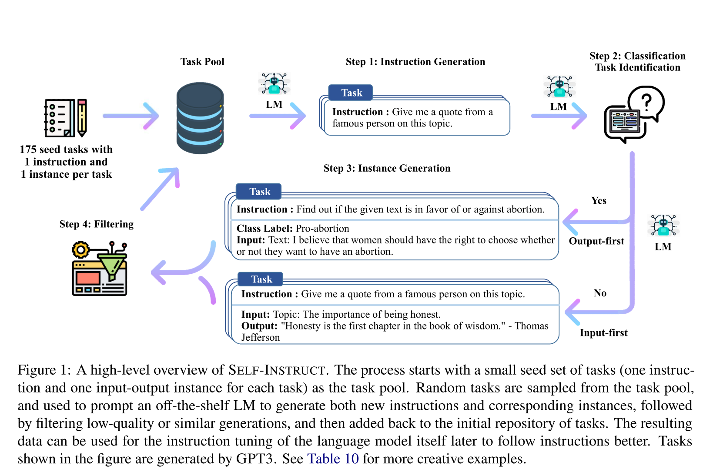
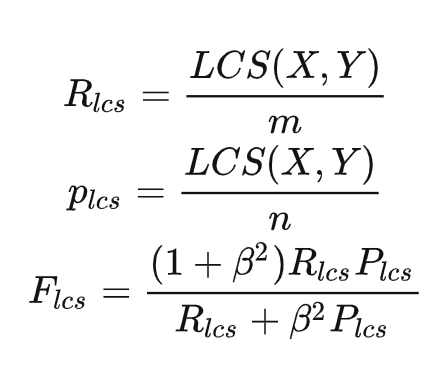

## SELF-INSTRUCT: Aligning Language Model with Self Generated Instructions

#### Introduction

An iterative boostrappoing algorithm, which starts with a limited (e.g., 175 in our study) seed set of manually-written instructions that are used to guide the overall generation.

    

STEPS:

1) instruction generation,
2) identifying whether the instruction represents a classifi- cation task or not, 
3) instance generation with the input-first or the output-first approach
4) filtering low-quality data.

#### Method

##### Defination
The instruction data we want to generate contains a set of instructions {$I_t$}, each of which defines a task $t$ in natural language. **Each task has one or more input-output instances ($X_t, Y_t$).** A model $M$ is expected to produce the output $y$, given the task instruction $I_t$ and the instance input $x$: $M(I_t, x)= y$, for $(x, y)\in(X_t, Y_t)$. 

***Note that the instruction and instance input does not have a strict boundary in many cases***

$x$ could be empty.

##### Automatic Instruction Data Generation
1) **Instruction Generation**: Task pool with 175 human-written tasks. Every step, 8 instructions are sampled. 6 human-written + 2 model generated (to increase diversity).
2) **Classification Task Identification**: Use GPT3 + few shot(two types 12:19 of instructions from the seed tasks) to define whether the generated instruction represents a classification task or not.
3) **Instance Generation**: Pretrained LLM + prompts from instruction-input-output in-context examples from other tasks.
    1) Input-first Approach (Instruction -> input ->output) ***!!Generate inputs biased toward one label, espacially for classification problem***
    2) Output-first Approach (Instriction-> label ->input)

4）Filtering and Postprocessing: add a new instruction to the task pool only when its ROUGE-L<0.7 overlap with any existing instruction is less than 0.7. Filter new instances. (Hard to processed by LLM, same one, same input+ diff output)
    

    

##### Finetune the LM to follow instructions
Use 52k instruction data to finetune the LM. 
**Concatenate the instruction and instance input as a prompt and train the model to generate the instance output in a standard supervised way.**
Multiple templates to encode the instruction and instance input together.
