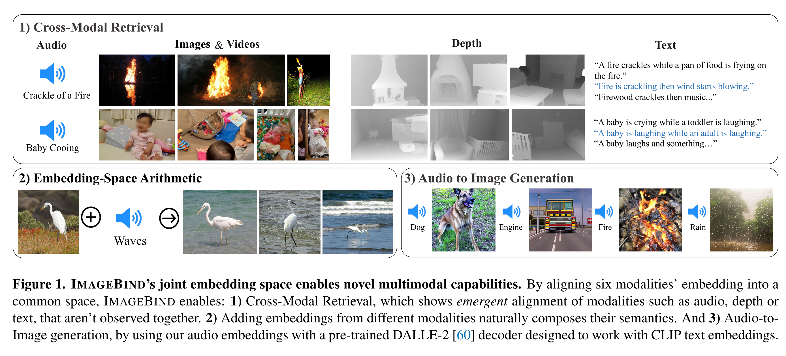
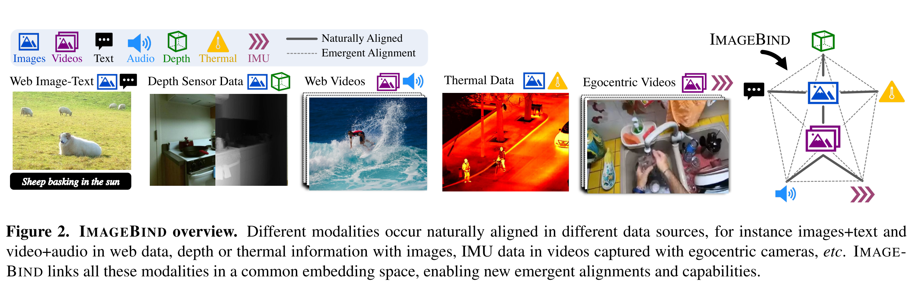
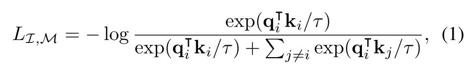

## ImageBIND

    

#### Abstract

1. An approach to learn a joint embedding across six different modalities - images, text, audio, depth, thermal, and IMU data. 
2. All combinations of paired data are not necessary to train such a joint embedding, and **only image-paired data** is sufficient to bind the modalities together. 
3. IMAGEBIND can leverage recent large scale vision-language models, and extends their **zero-shot capabilities** to new modalities just by using their natu- ral pairing with images.

#### Method
1. we present IMAGEBIND, which learns a single shared representation space by leveraging multiple types of image-paired data. Just aligning each modality’s embedding to image embeddings leads to an emergent alignment across all of the modalities.
2. We use large-scale image-text paired data (CLIP) along with naturally paired ‘self-supervised’ data across four new modal- ities - audio, depth, thermal, and Inertial Measurement Unit (IMU) readings – and show strong emergent zero-shot clas- sification and retrieval performance on tasks for each of these modalities. 

    

#### InfoNCE

    

NCE: Noise-Contrastive Estimation

we use a symmetric loss LI,M + LM,I. 

#### Implamentation details

1. Use Transformer for all the modality encoder
2. Vision Transformer (ViT) for images, videos (2 frame from 2 sec video, inflate ViT patch projection), depth(1D image) & therimal images(1D images)
3. Audio: 2sec, 16khz into spectrograms using 128 mel-spectrogram bins. As 2D signal, patch size of 16, stride 10, ViT
4. IMU: IMU signal consisting of accelerometer and gyroscope measurements across the X, Y, and Z axes. We use 5 second clips resulting in 2K time step IMU readings which are projected using a 1D convolution with a kernel size of 8. Then use transformer.
5. Text: CLIP

**Text and image encoder the same as CLIP!**
