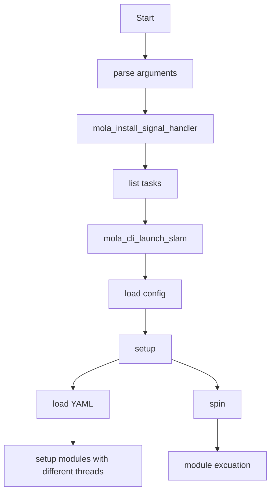
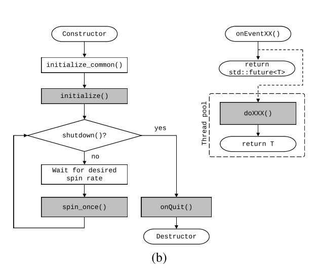

[TOC]
# 1. MOLA简介
## 1.1 背景
异质sensor的整合到一个SLAM方案中绝非易事，理论层面上的障碍包括不同SLAM系统对于机器人传感器系统、地图的几何描述以及机器人状态描述各不相同。目前的整合方案是图形推理库（graphical inference libraries）：g2o, GTSAM, Ceres，这些库常用来做后端。但这同一个完整但SLAM方案还是有gap的。
## 1.2 目标
MOLA是RSS2019的文章，提出了一个开源的异质数据融合的模块化SLAM系统。这里将前端、后端、回环闭合及其对应的状态都做了封装。这样可以最小化模块之间的依赖，并进行针对性的实现替换。

上述实现是单进程，每个模块都至少在一个线程中运行，利用shared_ptr<>实现。为方便模块封装，所有模块都来自于一个基类：有标准的生命周期，可以同步的或者按照相应输入事件动态的开启或者悬挂。

## 1.3 内容
1. SLAM有统一的数学框架，独立于pose（SE2，SE3），独立于地图（统一的或者是子图集合）
2. 独立于地图生成数据源（lidar/visual）的ORB特征的回环检测
3.  支持：2D/3D Lidar，stereo，mono相机，odometery，IMU和GPS
4. 可以配置系统状态：pose，pose和线速度，pose和角速度
5. 可配置相对坐标，可以有子地图。可以加入语义信息和层级表示
6. 支持多种地图格式（无序、特征点、线、面），支持可扩展
7. 支持优化模式配置：平滑或者批量优化
8. debug工具：支持断点和定位
9. 支持在线离线数据统一处理接口
10. 自动的数据释放和加载 
11. 关于视觉部分可配置：feature，pose格式，动力学信息（线速度，角速度及biases）
12. sensors有预置基类，用户可以自行扩充
13. system loader负责载入config，调起相应模块并建立模块间的桥接，并允许其间的信息流动。

# 2. MOLA架构

输入方面，即支持在线数据也支持离线序列。
于此同时，针对目前SLAM的离散处理，还提出了一套连续时间处理方案（这部分代码仍未实现）。本文方法在传统的基于关键帧方法和连续时间SLAM方法找了一个折中点。
## 2.1 前端
利用统一API接口实现前端统一：
1. 添加关键帧（该时间戳下已被创建则调用已有）
2. 添加限定因子（factor in graph）在该层面上因子已进行抽象化（SE2 或SE3）
3. 订阅当前pose
4. 广播内部变量调整信息
## 2.2 后端
SLAM后端负责把前端输出转化为图模型。后端有两种：全局地图和一系列局部地图（子图）。基于子图的SLAM实现可以将不用子图暂时序列化存储，减少内存占用并加速定位。两套系统分别对应绝对位姿SLAM和相对位姿SLAM。这两种表达方式对于前端来说没有任何影响。
### 2.2.1 相对位姿描述的后端
相对位姿描述SLAM后端时包含变量：
两个子图有各自的先验因子，还有一个描述两个子图相对位姿的参数。该相对位姿的限定条件是两个子图的共视特征。
每个子图中的关键帧观测的特征，与这些相对位姿变量有关。
因此，划分子图的规则就是子图之间跨边界的共视区域最小化。
## 2.3 世界模型（地图）
### 2.3.1 构成
**world model**也就是地图，由两种目标构成：实体Entity和关系Relation。
**Entity**包含：不同的相对绝对位姿，动力学信息以及关键帧信息。
**Relation** 描述了两个关键帧之间的相对姿态限定。
### 2.3.2 关键帧
关键帧的原始信息被地图保存下来，如有语义地图构建需要可以二次开发。对于在规定时间内没有被前端或后端访问的keyframe会将其快速二值序列化保存到硬盘中，用的时候（回环闭合）在快速载入。这只在map是独立module时才可以实现。
# 3. DEMO
## 3.1 环境及内容
**运行环境**
必须：GTSAM， MRPT和C++17.
可选：ROS
**调用方式**
命令行 & 库 + config文件
**支持范围**
目前，该系统前端利用multi-layer ICP实现跟踪，后端用子图优化和全局优化两种方法实现了**3D Lidar SLAM**部分，**其余视觉跟踪尚未实现**。
## 3.2. 3D Lidar SLAM
### 3.2.1 背景
LiDAR数据直接用ICP求解会很慢并且不准确，因为lidar采集特性使得近处点多远处点少。如果近处点过多会占据cost function主导地位，使得远处点无法正确匹配。
### 3.2.2 多层ICP前端
本文提出多层ICP策略，将数据划分为edge、plane, raw decimated。然后分层进行匹配。
1. 将原始lidar数据划分到1\*1\*1meter粒度的voxels中
2. 每个voxel只留一个点，点的类型由分类器给出。分类原理就是voxel中求相关矩阵的最大最小特征值分布。（一个绝对大是edge，两个绝对大是plane）。
3. 为了高效匹配，将所有voxel都存储到full-decimated layer。
4. 匹配跟踪
# 4. 改进点
1. 开源部分只给出3D Lidar SLAM，大量的视觉SLAM相关模块并没有开发
2. 动力学模型过于简单。文章中运动模型用了匀速模型，一般的视觉SLAM服务都不满足该条件
# 论文及代码
论文链接：
https://ingmec.ual.es/~jlblanco/papers/blanco2019mola_rss2019.pdf
代码网址：
https://github.com/MOLAorg/mola
使用文档：
https://docs.mola-slam.org/latest/
# Demo流程图

Module excuation graph:

