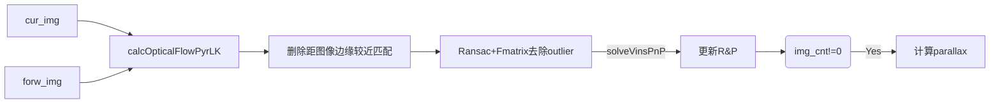
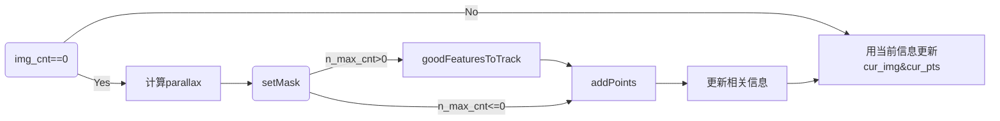

## processImage
ViewController.mm, `viewDidload` function, setup camera.
```
    /*******************************************Camera setup*******************************************/
    self.videoCamera = [[CvVideoCamera alloc]
                        initWithParentView:imageView];
    
    self.videoCamera.delegate = self;
    self.videoCamera.defaultAVCaptureDevicePosition =
    AVCaptureDevicePositionBack;
    
    self.videoCamera.defaultAVCaptureVideoOrientation = AVCaptureVideoOrientationPortrait;
    self.videoCamera.defaultAVCaptureSessionPreset =
    AVCaptureSessionPreset640x480;
#ifdef DATA_EXPORT
    self.videoCamera.defaultFPS = 1;
#else
    self.videoCamera.defaultFPS = 30;
#endif
    
    isCapturing = NO;
    
    [CameraUtils setExposureOffset: -1.0f];
    [videoCamera start];
```
调用opencv获取摄像头图像，在相机没有shutdown前，`processImage`会一直回调
`-(void)processImage:(cv::Mat&)image`
相机在capture状态中会做如下操作：

1. 获取系统时间`img_msg->header`&当前图像`input_frame`
2. 判断是否要旋转图像，`BOOL isNeedRotation`
3. 转成灰度图`gray`并进行直方图增强`img_equa`

```
        cv::Ptr<cv::CLAHE> clahe = cv::createCLAHE();
        clahe->setClipLimit(3);
        clahe->apply(gray, img_equa);
```
4. 更新特征`featuretracker.solved_features`&VINs结果`featuretracker.solved_vins`，其中feature及VINs数据定义如下：
```
struct VINS_RESULT {
    double header;
    Vector3d Ba;
    Vector3d Bg;
    Vector3d P;
    Matrix3d R;
    Vector3d V;
};

struct IMG_MSG_LOCAL {
    int id;
    Vector2d observation;
    Vector3d position;
    int track_num;
};
// Solved VINS feature feedback to featuretracker
list<IMG_MSG_LOCAL> solved_features;

// Solved VINS status feedback to featuretracker
VINS_RESULT solved_vins;
```
5. 更新IMU measurements `featuretracker.imu_msgs`
```
struct IMU_MSG_LOCAL {
    double header;
    Vector3d acc;
    Vector3d gyr;
};
vector<IMU_MSG_LOCAL> imu_msgs;
```
6. 跟踪函数：
```
void FeatureTracker::readImage(const cv::Mat &_img, cv::Mat &result, int _frame_cnt, vector<Point2f> &good_pts, vector<double> &track_len, double header, Vector3d &P, Matrix3d &R, bool vins_normal)
```
包含4个部分：
6.1 载入当前图像forw_img，并初始化跟踪结果forw_pts（清空）
6.2 track
`cur_img`是前一帧图像，`cur_pts`是前一帧特征点
`forw_img`是前一帧图像，`forw_pts`是前一帧特征点
跟踪流程图如下：

parallax放入`track_len`中：
`track_len.push_back(std::min(1.0, 1.0 * parallax/30));`
6.3 detect
`setMask`
`goodFeaturesToTrack`
`addPoints`
流程图如下：

6.4 在`img_cnt==0`时(每隔FREQ=3帧)，检查一次地图，更新新加入的mappoint点`map<int, Vector3d> image_msg`
