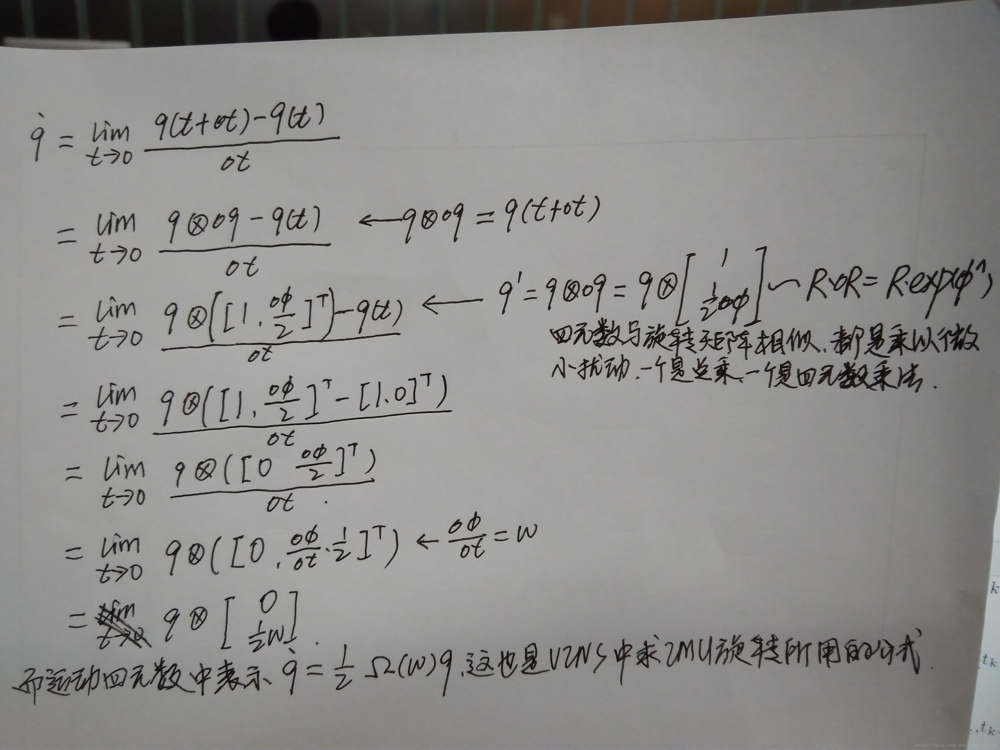
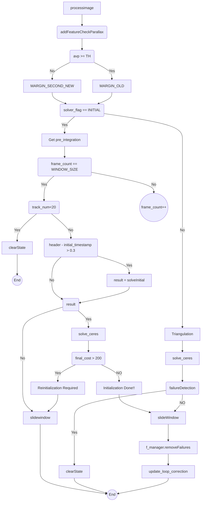

函数入口 viewController::process()
1. 收集measurements（可能含有若干对imu序列和对应的img数据，利用时间戳对齐）
`std::vector<std::pair<std::vector<ImuConstPtr>, ImgConstPtr>> measurements;`
1. 每次处理一个Measurement
    处理imu数据：`send_imu` 
    会调用`vins.processIMU(dt, Vector3d(dx, dy, dz), Vector3d(rx, ry, rz))`
    该函数负责进行imu预积分，这里采用midpoint积分更新第j帧（当前帧）旋转矩阵Rs[j],位置向量Ps[j],速度向量Vs[j]，具体定义：
```
void VINS::processIMU(double dt, const Vector3d &linear_acceleration, const Vector3d &angular_velocity)
```
角度更新：

```
//midpoint integration
{
    Vector3d g{0,0,GRAVITY};
    int j = frame_count;
    Vector3d un_acc_0 = Rs[j] * (acc_0 - Bas[j]) - g;
    Vector3d un_gyr = 0.5 * (gyr_0 + angular_velocity) - Bgs[j];
    Rs[j] *= Utility::deltaQ(un_gyr * dt).toRotationMatrix();
    Vector3d un_acc_1 = Rs[j] * (linear_acceleration - Bas[j]) - g;
    Vector3d un_acc = 0.5 * (un_acc_0 + un_acc_1);
    Ps[j] += dt * Vs[j] + 0.5 * dt * dt * un_acc;
    Vs[j] += dt * un_acc;
}
```
  
   处理点云数据：
   `map<int, Vector3d> image = img_msg->point_clouds;`
  `vins.processImage(image,header,waiting_lists);`
  
 



  
