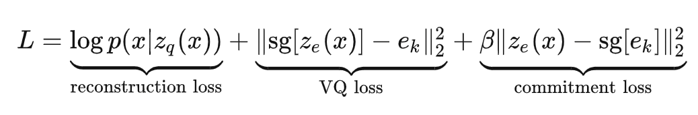

## VQVAE
#### VAE
VAEs consist of the following parts: an encoder network which parameterises a posterior distribution $q(z|x)$ of discrete latent random variables $z$ given the input data $x$, a prior distribution $p(z)$, and a decoder with a distribution $p(x|z)$ over input data.
Typically, the posteriors and priors in VAEs are assumed normally distributed with diagonal covariance, which allows for the Gaussian reparametrisation trick to be used.

#### Improvement
Vector Quantised- Variational AutoEncoder (VQ-VAE), differs from VAEs in two key ways: the encoder network outputs discrete, rather than continuous, codes; and the prior is learnt rather than static. 

#### Method

<p align="center">
    
</p>

##### Discrete Latent variables

1)  Latent embedding space $e \in R^{K \times D}$
        where K is the size of the latent space, D is the dimensionality of each latent embedding $e_i \in R^D$
2)  Encoder takes an image $x$ to produce output $z_e(x)$
3)  Discrete latent variables $z$ are calculated by nearest neighbor look-up using the shared embedding space $e$.
4)  Decoder takes $e_k$ as input. (Same as quantised result: $z_q(x)$)

<p align="center">
    
</p>


    
Three set of parameters: parameters of the encoder, decoder and the embedding space $e$
##### Learning
striaight-through estimator:
just copy gradients from decoder input $z_q(x)$ to encoder output $z_e(x)$.

1. The first term is the reconstruction loss (or the data term) which optimizes the decoder and the encoder (through the estimator explained above). 
2. In order to learn the embedding space, we use Vector Quantisation (VQ). The VQ objective uses the $l_2$ error to move the embedding vectors $e_i$ towards the encoder outputs $z_e(x)$ as shown in the second term of equation 
3. To make sure the encoder commits to an embedding and its output does not grow, we add a commitment loss, the third term in equation. Where sg stands for the stopgradient operator.

***The decoder optimises the first loss term only, the encoder optimises the first and the last loss terms, and the embeddings are optimised by the middle loss term***

<p align="center">
    
</p>


[Codeing from github](https://github.com/xiaohu2015/nngen/blob/main/models/vq_vae.ipynb)

`VectorQuantizer`

```python
class VectorQuantizer(nn.Module):
    """
    VQ-VAE layer: Input any tensor to be quantized. 
    Args:
        embedding_dim (int): the dimensionality of the tensors in the
          quantized space. Inputs to the modules must be in this format as well.
        num_embeddings (int): the number of vectors in the quantized space.
        commitment_cost (float): scalar which controls the weighting of the loss terms (see
          equation 4 in the paper - this variable is Beta).
    """
    def __init__(self, embedding_dim, num_embeddings, commitment_cost):
        super().__init__()
        self.embedding_dim = embedding_dim
        self.num_embeddings = num_embeddings
        self.commitment_cost = commitment_cost
        
        # initialize embeddings
        self.embeddings = nn.Embedding(self.num_embeddings, self.embedding_dim)
        
    def forward(self, x):
        # [B, C, H, W] -> [B, H, W, C]
        x = x.permute(0, 2, 3, 1).contiguous()
        # [B, H, W, C] -> [BHW, C]
        flat_x = x.reshape(-1, self.embedding_dim)
        
        encoding_indices = self.get_code_indices(flat_x)
        quantized = self.quantize(encoding_indices)
        quantized = quantized.view_as(x) # [B, H, W, C]
        
        if not self.training:
            quantized = quantized.permute(0, 3, 1, 2).contiguous()
            return quantized
        
        # embedding loss: move the embeddings towards the encoder's output
        q_latent_loss = F.mse_loss(quantized, x.detach())
        # commitment loss
        e_latent_loss = F.mse_loss(x, quantized.detach())
        loss = q_latent_loss + self.commitment_cost * e_latent_loss

        # Straight Through Estimator
        quantized = x + (quantized - x).detach()
        
        quantized = quantized.permute(0, 3, 1, 2).contiguous()
        return quantized, loss
    
    def get_code_indices(self, flat_x):
        # compute L2 distance
        distances = (
            torch.sum(flat_x ** 2, dim=1, keepdim=True) +
            torch.sum(self.embeddings.weight ** 2, dim=1) -
            2. * torch.matmul(flat_x, self.embeddings.weight.t())
        ) # [N, M]
        encoding_indices = torch.argmin(distances, dim=1) # [N,]
        return encoding_indices
    
    def quantize(self, encoding_indices):
        """Returns embedding tensor for a batch of indices."""
        return self.embeddings(encoding_indices)      
```

`Encoder and decoder`

```python
class Encoder(nn.Module):
    """Encoder of VQ-VAE"""
    
    def __init__(self, in_dim=3, latent_dim=16):
        super().__init__()
        self.in_dim = in_dim
        self.latent_dim = latent_dim
        
        self.convs = nn.Sequential(
            nn.Conv2d(in_dim, 32, 3, stride=2, padding=1),
            nn.ReLU(inplace=True),
            nn.Conv2d(32, 64, 3, stride=2, padding=1),
            nn.ReLU(inplace=True),
            nn.Conv2d(64, latent_dim, 1),
        )
        
    def forward(self, x):
        return self.convs(x)
    

class Decoder(nn.Module):
    """Decoder of VQ-VAE"""
    
    def __init__(self, out_dim=1, latent_dim=16):
        super().__init__()
        self.out_dim = out_dim
        self.latent_dim = latent_dim
        
        self.convs = nn.Sequential(
            nn.ConvTranspose2d(latent_dim, 64, 3, stride=2, padding=1, output_padding=1),
            nn.ReLU(inplace=True),
            nn.ConvTranspose2d(64, 32, 3, stride=2, padding=1, output_padding=1),
            nn.ReLU(inplace=True),
            nn.ConvTranspose2d(32, out_dim, 3, padding=1),
        )
        
    def forward(self, x):
        return self.convs(x)
        
```

`VQVAE`

```python
class VQVAE(nn.Module):
    """VQ-VAE"""
    
    def __init__(self, in_dim, embedding_dim, num_embeddings, data_variance, 
                 commitment_cost=0.25):
        super().__init__()
        self.in_dim = in_dim
        self.embedding_dim = embedding_dim
        self.num_embeddings = num_embeddings
        self.data_variance = data_variance
        
        self.encoder = Encoder(in_dim, embedding_dim)
        self.vq_layer = VectorQuantizer(embedding_dim, num_embeddings, commitment_cost)
        self.decoder = Decoder(in_dim, embedding_dim)
        
    def forward(self, x):
        z = self.encoder(x)
        if not self.training:
            e = self.vq_layer(z)
            x_recon = self.decoder(e)
            return e, x_recon
        
        e, e_q_loss = self.vq_layer(z)
        x_recon = self.decoder(e)
        
        recon_loss = F.mse_loss(x_recon, x) / self.data_variance
        
        return e_q_loss + recon_loss    
```

`Training code:`

```python

batch_size = 128
embedding_dim = 16
num_embeddings = 128

transform=transforms.Compose([
    transforms.ToTensor(),
])

dataset1 = datasets.MNIST('/data', train=True, download=True,
                       transform=transform)
dataset2 = datasets.MNIST('/data', train=False,
                       transform=transform)
train_loader = torch.utils.data.DataLoader(dataset1, batch_size=batch_size, shuffle=True)
test_loader = torch.utils.data.DataLoader(dataset2, batch_size=batch_size)

# compute the variance of the whole training set to normalise the Mean Squared Error below.
train_images = []
for images, labels in train_loader:
    train_images.append(images)
train_images = torch.cat(train_images, dim=0)
train_data_variance = torch.var(train_images)

model = VQVAE(1, embedding_dim, num_embeddings, train_data_variance)
model = model.cuda()

optimizer = torch.optim.Adam(model.parameters(), lr=1e-3)

# train VQ-VAE
epochs = 30
print_freq = 500

for epoch in range(epochs):
    print("Start training epoch {}".format(epoch,))
    for i, (images, labels) in enumerate(train_loader):
        images = images - 0.5 # normalize to [-0.5, 0.5]
        images = images.cuda()
        loss = model(images)
        optimizer.zero_grad()
        loss.backward()
        optimizer.step()
        if (i + 1) % print_freq == 0 or (i + 1) == len(train_loader):
            print("\t [{}/{}]: loss {}".format(i, len(train_loader), loss.item()))

```